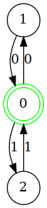

```python
    AutomaDeterministico(
        name='soloCopieDiNumeri',
        alphabet = {'0', '1'},                  # alfabeto = 0 1 2
        states = {'0', '1', '2'},               # stati = 1 2 3 4 5
        start_state = '0',                      # stato iniziale = 1
        final_states = {'0'},                   # stati finali = C
        transitions = {                         # transizioni: 
            ('0', '0'): '1',        # se entra uno 0
            ('0', '1'): '2',            # sentra un 1
            ('1', '0'): '0',        # ..solo se entra un altro 0 torniamo allo stato iniziale/finale
            ('2', '1'): '0'             # ..solo se entra un altro 1 torniamo allo stato iniziale/finale
        }
    )
```

